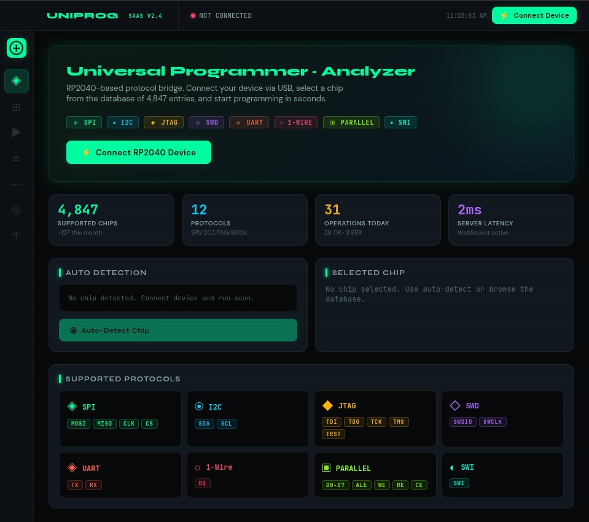
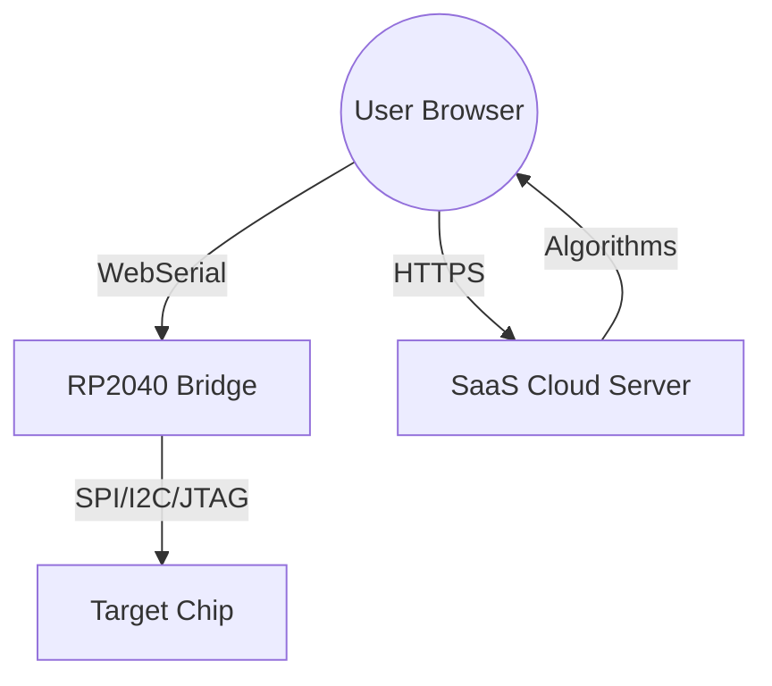

# UniProger — Universal Professional SaaS Programmer-Analyzer

<p align="center">
<b>Професійна SaaS-платформа для програмування, зчитування та аналізу мікросхем на базі RP2040</b>
</p>

<p align="center">
  
</p>

## 🚀 Концепція "Thin Bridge"
На відміну від традиційних програматорів (Minipro, RT809, Flashcat), де вся логіка зашита у прошивку, **UniProger** використовує архітектуру **SaaS + Gateway**:

1.  **RP2040 (Bridge)**: Виступає як швидкісний шлюз. Він не знає алгоритмів конкретних мікросхем, а лише виконує низькорівневі команди (SPI/I2C/GPIO) через стабільний бінарний протокол.
2.  **SaaS Server (Node.js)**: Містить всю "інтелектуальну" частину, алгоритми таймінгів, базу даних чіпів (10,000+) та логіку верифікації.
3.  **Web Dashboard (React)**: Надає преміальний інтерфейс у браузері з WebSerial API для прямого керування "залізом" без встановлення драйверів.

---

## 🎯 Можливості

| Функція | Опис |
|---------|------|
| **SaaS Cloud** | Робота в браузері без необхідності встановлення софту |
| **Універсальність** | Підтримка SPI, I2C, Microwire, OneWire, JTAG, SWD, UART |
| **Logic Analyzer** | Вбудований сніфер протоколів для дебагу "на льоту" |
| **Smart Identify** | Автоматичне визначення чіпа за JEDEC ID або сигнатурою |
| **Hex Editor** | Професійний редактор дампів безпосередньо в інтерфейсі |
| **Cloud Sync** | Ваші дампи та налаштування доступні з будь-якого пристрою |

---

## 🔧 Структура проєкту

- `/frontend`: React + Vite кабінет з підтримкою WebSerial.
- `/backend`: Node.js сервер з базою даних чіпів та алгоритмами.
- `/firmware`: C прошивка для RP2040 (Bridge Protocol).
- `/include`: Спільні типи та HAL-інтерфейси.

---

## 🏗️ Архітектура Системи



---

## 📦 Швидкий старт (Development)

### 1. Збірка прошивки (RP2040)
```bash
cd firmware
mkdir build && cd build
cmake ..
make -j$(nproc)
# Прошийте uniprog_bridge.uf2 на Pico
```

### 2. Запуск Backend
```bash
cd backend
npm install
npm start
```

### 3. Запуск Frontend
```bash
cd frontend
npm install
npm run dev
```

---

## 🔌 Розводка контактів (Pico Bridge)

| Сигнал | GPIO | Пін Pico | Опис |
|---------|------|----------|------|
| **MOSI / SDA** | GP19 | 25 | Data Out / Serial Data |
| **SCK / SCL** | GP18 | 24 | Clock |
| **MISO** | GP16 | 21 | Data In |
| **CS / Reset**| GP17 | 22 | Chip Select / Reset |
| **SWCLK / TCK**| GP18 | 24 | JTAG/SWD Clock |
| **SWDIO / TMS**| GP19 | 25 | JTAG/SWD Data |
| **TDI** | GP20 | 26 | JTAG Data In |
| **TDO** | GP21 | 27 | JTAG Data Out |
| **nRESET** | GP22 | 29 | System Reset |

---

## 📄 Ліцензія

MIT License — Користуйтеся, створюйте, покращуйте.
